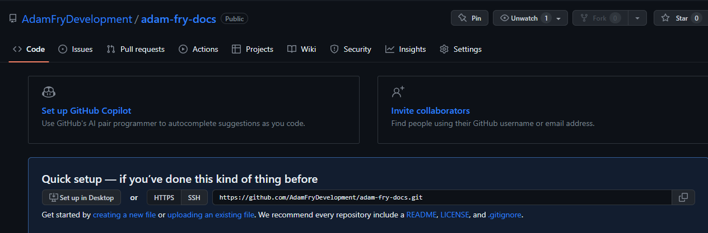

Using Github for Version Control
================================
We can create a github repo to store our documentation project.  If you don't already have a github account, sign up for one at https://github.com/

Creating a repo
---------------
To manage the project on github, first create a repo to store the project files. Once the repo is created, GitHub will provide some information about your repo.  Copy the https git link: 

GitIgnore
---------
The _build folder that is created by the make command is generally not wanted in our source control repository.  Add a .gitignore file to the project and content to specify that this should be excluded.  Create a new file in the root of the project folder named .gitignore and add the following content to the file: 

.. code-block::

   _build/

Create local repository
-----------------------
Before we can push to a remote repository, first setup the local repository in VSCode.  Click the source control icon or press CTRL+SHIFT+G to open the source control pane.  Click the initialize icon button to initialize the local repository.  If prompted for the local repository folder, select the root folder.  

Create initial commit
---------------------
Enter a message for the initial commit and click the commit button.